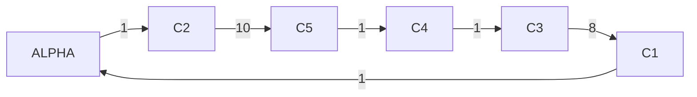

# Rapport TP n°1 - Recherche opérationnel
Auteur : Baptiste DESNOUCK et Baptiste ARRIX

## 2.1.1 Assemblage

### Choix du type de programme

Si **un vélo est construit en une fois** et ne peut pas être fabriqué en pièces détachées, alors la quantité de vélo sera entière et donc le programme sera **linéaire en nombres entiers (PLNE)**.


Si **un vélo peut être fabriqué en pièces détachées** et l'assemblage peut être réalisé en plusieurs étapes, alors la quantité de vélo est réelle (On peut fabriqué que la roue d'un vélo par exemple). Ainsi, le programme est **linéaire (PL)**

### Variables

**Cas PLNE**

\[ qc \in \mathbb{N} \text{ : Quantité de vélo Cargo}\]

\[ qs \in \mathbb{N} \text{ : Quantité de vélo standard}\]

**<u>Rmq :</u> On remplace \(\mathbb{N}\) par \(\mathbb{R}\) dans le cas PL**

### Format de fichier choisi

Cette modélisation possède seulement 2 variables (réelle ou entière) et le nombre de variable ne dépend pas des données d'entrées. Ainsi, **le format de fichier `.lp` est le plus adapté.**

### Résultats

#### PLNE
```plaintext
Objective:  Benefice = 438400 (MAXimum)

   No.   Row name        Activity     Lower bound   Upper bound
------ ------------    ------------- ------------- -------------
     1 CapaciteHoraire
                               59.92                          60 
     2 CapaciteParking
                                1500                        1500 
     3 MaxVeloCargo              232                         700 

   No. Column name       Activity     Lower bound   Upper bound
------ ------------    ------------- ------------- -------------
     1 Qc           *            232             0               
     2 Qs           *            920             0                          
```

#### PL

```plaintext
Objective:  Benefice = 438461.5385 (MAXimum)

   No.   Row name   St   Activity     Lower bound   Upper bound    Marginal
------ ------------ -- ------------- ------------- ------------- -------------
     1 CapaciteHoraire
                    NU            60                          60       769.231 
     2 CapaciteParking
                    NU          1500                        1500       261.538 
     3 MaxVeloCargo B        230.769                         700 

   No. Column name  St   Activity     Lower bound   Upper bound    Marginal
------ ------------ -- ------------- ------------- ------------- -------------
     1 Qc           B        230.769             0               
     2 Qs           B        923.077             0                    
```

### Commentaires

Le résultat dans le cas PLNE parait cohérent : 
- L'ordre de grandeur du bénéfice est respecté
- Le parking est plein puisqu'il faut fabriqué le plus de vélo possible
- Etant donné que "construire 2 vélo standard" ou "construire 1 vélo cargo" ont à peu près le même coût (L'un est un peu plus chère mais l'autre prend un peu moins de place sur le parking), cela parait cohérent que la capacité en vélo cargo n'ait pas été rempli.

Le résultat pour PL est proche et un peu meilleur que PLNE ce qui est logique vu qu'on peut diviser les vélos en pièces détachées et en fabriquer qu'une seule partie des pièces détachées.

## 2.1.2 Affectation avec prise en compte des préférences

### Variables

\[ (b_{ij})_{(i,j) \in \mathbb{N}^2} \in \{0,1\}^{\mathbb{N}} : \text{ Si l'employé } i \text{ est associé à la tâche } j, \text{ alors } b_{ij} = 1 \text{ sinon } 0 \]

### Fonction Objectif
\[
\max \sum_{i=1}^{n} \sum_{j=1}^{n} b_{ij} \cdot c_{ij}
\]

avec \( c \) la matrice des choix

Grâce aux variables qui sont booléennes, on peut faire seulement la somme des préférences qui ont été choisies.

### Contraintes

- Une seule tâche ne peut être associée qu'à un seul employé
Pour tout \( j \), \(\sum_{i=1}^{n} b_{ij} = 1\)

- Un employé ne peut être associé qu'à une seule tâche
Pour tout \( i \), \(\sum_{j=1}^{n} b_{ij} = 1\)

### Format de fichier choisi

Cette modélisation possède une matrice de variables avec une taille non fixe. Ainsi, **le format de fichier `.mod` est le plus adapté.**

### Résultat

Données : 
```
set EMPLOYERS := 
Pierre
Jack
Baptiste;

set TACHES :=
NettoyerCuisine
Manger
FaireProjetIDM;

param scoreTache: NettoyerCuisine Manger FaireProjetIDM :=
Pierre 9 2 1
Jack 5 5 5
Baptiste 3 10 0;
```
Résultat : 

```
Objective:  ScoreTotal = 24 (MAXimum)

   No.   Row name        Activity     Lower bound   Upper bound
------ ------------    ------------- ------------- -------------
     1 UnEmployerParTache[NettoyerCuisine]
                                   1             1             = 
     2 UnEmployerParTache[Manger]
                                   1             1             = 
     3 UnEmployerParTache[FaireProjetIDM]
                                   1             1             = 
     4 UneTacheParEmployer[Pierre]
                                   1             1             = 
     5 UneTacheParEmployer[Jack]
                                   1             1             = 
     6 UneTacheParEmployer[Baptiste]
                                   1             1             = 
     7 ScoreTotal                 24                             

   No. Column name       Activity     Lower bound   Upper bound
------ ------------    ------------- ------------- -------------
     1 B[Pierre,NettoyerCuisine]
                    *              1             0             1 
     2 B[Jack,NettoyerCuisine]
                    *              0             0             1 
     3 B[Baptiste,NettoyerCuisine]
                    *              0             0             1 
     4 B[Pierre,Manger]
                    *              0             0             1 
     5 B[Jack,Manger]
                    *              0             0             1 
     6 B[Baptiste,Manger]
                    *              1             0             1 
     7 B[Pierre,FaireProjetIDM]
                    *              0             0             1 
     8 B[Jack,FaireProjetIDM]
                    *              1             0             1 
     9 B[Baptiste,FaireProjetIDM]
                    *              0             0             1 
```

En regardant les données, on distingue très clairement que la meilleure répartition est de donner à Pierre "NettoyerCuisine" vu que c'est sa tâche préférée ; à Baptiste "Manger" vu que c'est également sa tâche préférée ; et enfin, à Jack ce qui reste vu qu'il n'a pas de préférence sur les tâches.
Le résultat obtenu est alors correct au vu des explications précédentes.

## 2.2.1 E-Commerce

### Variables

Pour PL : 

\[ (q_{fmd})_{(f,m,d) \in \mathbb{N}^3} \in \mathbb{R}^{\mathbb{N}} : \text{Quantité de fluide } f \text{ prise dans le magasin } m \text{ pour la commande } d \]

Rmq : Pour PLNE, on remplace \(\mathbb{R}\) par \(\mathbb{N}\)
### Fonction Objectif
\[
\min \sum_{f,m,d} c_{mf} \cdot q_{fmd}
\]

avec \( c \) cout unitaire par fluide par magasin

### Contraintes

- Respect des stocks pour chaque magasin et fluide :
\[
\forall m,f, \sum_{d} q_{fmd} \leq \text{fluideParMagasin}[m,f]
\]

- Respect des commandes pour chaque commande et fluide :
\[
\forall d, f, \sum_{m} q_{fmd} = \text{fluideParCommande}[d,f]
\]

### Format de fichier choisi

Cette modélisation possède une matrice de variables avec une taille non fixe. Ainsi, **le format de fichier `.mod` est le plus adapté.**

### Résultat PL

Pour les données du sujet : 

```
Objective:  Cout = 9.5 (MINimum)

   No.   Row name   St   Activity     Lower bound   Upper bound    Marginal
------ ------------ -- ------------- ------------- ------------- -------------
     1 RespectStock[M1,F1]
                    NU           2.5                         2.5            -1 
     2 RespectStock[M1,F2]
                    NU             1                           1            -2 
     3 RespectStock[M2,F1]
                    B            0.5                           1 
     4 RespectStock[M2,F2]
                    B              1                           2 
     5 RespectStock[M3,F1]
                    B              0                           2 
     6 RespectStock[M3,F2]
                    NU             1                           1            -1 
     7 RespectCommande[D1,F1]
                    NS             2             2             =             2 
     8 RespectCommande[D1,F2]
                    B              0            -0             = 
     9 RespectCommande[D2,F1]
                    NS             1             1             =             2 
    10 RespectCommande[D2,F2]
                    NS             3             3             =             3 
    11 Cout         B            9.5                             

   No. Column name  St   Activity     Lower bound   Upper bound    Marginal
------ ------------ -- ------------- ------------- ------------- -------------
     1 Q[F1,M1,D1]  B              2             0               
     2 Q[F1,M1,D2]  B            0.5             0               
     3 Q[F2,M1,D1]  NL             0             0                           3 
     4 Q[F2,M1,D2]  B              1             0               
     5 Q[F1,M2,D1]  NL             0             0                       < eps
     6 Q[F1,M2,D2]  B            0.5             0               
     7 Q[F2,M2,D1]  NL             0             0                           3 
     8 Q[F2,M2,D2]  B              1             0               
     9 Q[F1,M3,D1]  NL             0             0                           1 
    10 Q[F1,M3,D2]  NL             0             0                           1 
    11 Q[F2,M3,D1]  NL             0             0                           3 
    12 Q[F2,M3,D2]  B              1             0               
```

### Résultat PLNE

```
Objective:  Cout = 10 (MINimum)

   No.   Row name        Activity     Lower bound   Upper bound
------ ------------    ------------- ------------- -------------
     1 RespectStock[M1,F1]
                                   2                         2.5 
     2 RespectStock[M1,F2]
                                   1                           1 
     3 RespectStock[M2,F1]
                                   1                           1 
     4 RespectStock[M2,F2]
                                   1                           2 
     5 RespectStock[M3,F1]
                                   0                           2 
     6 RespectStock[M3,F2]
                                   1                           1 
     7 RespectCommande[D1,F1]
                                   2             2             = 
     8 RespectCommande[D1,F2]
                                   0            -0             = 
     9 RespectCommande[D2,F1]
                                   1             1             = 
    10 RespectCommande[D2,F2]
                                   3             3             = 
    11 Cout                       10                             

   No. Column name       Activity     Lower bound   Upper bound
------ ------------    ------------- ------------- -------------
     1 Q[F1,M1,D1]  *              1             0               
     2 Q[F1,M1,D2]  *              1             0               
     3 Q[F2,M1,D1]  *              0             0               
     4 Q[F2,M1,D2]  *              1             0               
     5 Q[F1,M2,D1]  *              1             0               
     6 Q[F1,M2,D2]  *              0             0               
     7 Q[F2,M2,D1]  *              0             0               
     8 Q[F2,M2,D2]  *              1             0               
     9 Q[F1,M3,D1]  *              0             0               
    10 Q[F1,M3,D2]  *              0             0               
    11 Q[F2,M3,D1]  *              0             0               
    12 Q[F2,M3,D2]  *              1             0               
```
Les deux résultats semblent cohérents au vu de l'ordre de grandeur du coût. Comme précédemment, le coût en PL est légèrement meilleur que le coût en PLNE (c'est-à-dire ici, moins élevé), ce qui est logique puisque l'espace des solutions diminue.

## 2.2.2 E-Commerce avec coûts fixes et variables

### Variables

\[ (q_{fmd})_{(f,m,d) \in \mathbb{N}^3} \in \mathbb{N}^{\mathbb{N}} : \text{Quantité de colis } f \text{ prise dans le magasin } m \text{ pour la commande } d \]

\[ (y_{md})_{(m,d) \in \mathbb{N}^2} \in \{0,1\}^{\mathbb{N}} : \text{Si le magasin } m \text{ est utilisé pour la commande } d, \text{ alors } y_{md} = 1 \text{ sinon } 0 \]

### Fonction Objectif
\[
\min \left( \sum_{f,m,d} q_{fmd} \cdot c_{vmd} + \sum_{m,d} y_{md} \cdot c_{fmd} \right)
\]

avec \( c_{vmd} \) le coût variable par colis par magasin et \( c_{fmd} \) le coût fixe par commande par magasin

### Contraintes

- Respect des stocks pour chaque magasin et colis :
\[
\forall m,f, \sum_{d} q_{fmd} \leq \text{colisParMagasin}[m,f]
\]

- Respect des commandes pour chaque commande et colis :
\[
\forall d,f, \sum_{m} q_{fmd} = \text{colisParCommande}[d,f]
\]

- Répartition des magasins (\(y\) doit être égale à 1 quand la quantité pour un magasin m et une commande d donnée est positive, ce qui signifie la commande d est utilisée dans le magasin m) :
\[
\forall d,m ~~~ M \cdot y_{md} \geq \sum_{f} q_{fmd}
\]

\(M\) étant une grande constante.

- Répartition des magasins (De la même façon que la contrainte précédentes, \(y\) doit être égale à 0 quand la quantité pour un magasin m et une commande d donnée est nulle) :
\[
\forall d,m, y_{md} \leq \sum_{f} q_{fmd}
\]


### Format de fichier choisi

Cette modélisation possède une matrice de variables avec une taille non fixe. Ainsi, **le format de fichier `.mod` est le plus adapté.**

### Résultat

Sur les données du sujet : 

```
Objective:  Cout = 354 (MINimum)

   No.   Row name        Activity     Lower bound   Upper bound
------ ------------    ------------- ------------- -------------
     1 RespectStock[M1,F1]
                                   1                         2.5 
     2 RespectStock[M1,F2]
                                   1                           1 
     3 RespectStock[M2,F1]
                                   0                           1 
     4 RespectStock[M2,F2]
                                   2                           2 
     5 RespectStock[M3,F1]
                                   2                           2 
     6 RespectStock[M3,F2]
                                   0                           1 
     7 RespectCommande[D1,F1]
                                   2             2             = 
     8 RespectCommande[D1,F2]
                                   0            -0             = 
     9 RespectCommande[D2,F1]
                                   1             1             = 
    10 RespectCommande[D2,F2]
                                   3             3             = 
    11 RespectRepartitionMagasin1[D1,M1]
                                   0            -0               
    12 RespectRepartitionMagasin1[D1,M2]
                                   0            -0               
    13 RespectRepartitionMagasin1[D1,M3]
                                 998            -0               
    14 RespectRepartitionMagasin1[D2,M1]
                                 998            -0               
    15 RespectRepartitionMagasin1[D2,M2]
                                 998            -0               
    16 RespectRepartitionMagasin1[D2,M3]
                                   0            -0               
    17 RespectRepartitionMagasin2[D1,M1]
                                   0                          -0 
    18 RespectRepartitionMagasin2[D1,M2]
                                   0                          -0 
    19 RespectRepartitionMagasin2[D1,M3]
                                  -1                          -0 
    20 RespectRepartitionMagasin2[D2,M1]
                                  -1                          -0 
    21 RespectRepartitionMagasin2[D2,M2]
                                  -1                          -0 
    22 RespectRepartitionMagasin2[D2,M3]
                                   0                          -0 
    23 Cout                      354                             

   No. Column name       Activity     Lower bound   Upper bound
------ ------------    ------------- ------------- -------------
     1 Q[F1,M1,D1]  *              0             0               
     2 Q[F1,M1,D2]  *              1             0               
     3 Q[F2,M1,D1]  *              0             0               
     4 Q[F2,M1,D2]  *              1             0               
     5 Q[F1,M2,D1]  *              0             0               
     6 Q[F1,M2,D2]  *              0             0               
     7 Q[F2,M2,D1]  *              0             0               
     8 Q[F2,M2,D2]  *              2             0               
     9 Q[F1,M3,D1]  *              2             0               
    10 Q[F1,M3,D2]  *              0             0               
    11 Q[F2,M3,D1]  *              0             0               
    12 Q[F2,M3,D2]  *              0             0               
    13 Y[M1,D1]     *              0             0             1 
    14 Y[M2,D1]     *              0             0             1 
    15 Y[M3,D1]     *              1             0             1 
    16 Y[M1,D2]     *              1             0             1 
    17 Y[M2,D2]     *              1             0             1 
    18 Y[M3,D2]     *              0             0             1 
```

Les résultats obtenus respectent l'ordre de grandeur attendu : les coûts fixes sont de l'ordre de la centaine et les coûts variables de l'ordre de la dizaine. Donc, le coût optimal est de l'ordre de la centaine. De plus, les contraintes de répartition des magasins sont correctement validées, c'est-à-dire qu'on n'a pas de magasin utilisé pour une commande sans prendre de colis, et vice-versa.

## 2.2.3 Livreur

Ce problème correspond au voyageur du commerce.

### Variables

\[ X_{ij} \in \{0,1\} : \text{Si l'arc qui va du lieu } i \text{ au lieu } j \text{ est sélectionné}, \text{ alors } X_{ij} = 1 \text{ sinon } 0 \]

\[ U_i \in \mathbb{R} : \text{Variable auxiliaire pour éviter les sous-tours homogène à une distance (Représente la distance depuis le départ)} \]

### Fonction Objectif

\[
\min \sum_{i=1}^{n} \sum_{j=1}^{n} X_{ij} \cdot \text{distance}_{ij}
\]

### Contraintes

- Départ de chaque lieu :
\[
\forall i, \sum_{j=1}^{n} X_{i,j} = 1
\]

- Arrivée à chaque lieu :
\[
\forall j, \sum_{i=1}^{n} X_{i,j} = 1
\]

- Pas de réflexivité :
\[
\forall i, X_{i,i} = 0
\]

- Éviter les sous-tours :
\[
\forall i, j \neq i, U_j - U_i \geq \text{distance}_{ij} - (1 - X_{i,j}) \cdot M
\]

où \( M \) est une grande constante.

### Format de fichier choisi

Cette modélisation possède une matrice de variables avec une taille non fixe. Ainsi, **le format de fichier `.mod` est le plus adapté.**

### Modèle

```plaintext
Objective:  Cout = 22 (MINimum)

   No.   Row name        Activity     Lower bound   Upper bound
------ ------------    ------------- ------------- -------------
     1 DepartChaqueLieu[1]
                                   1             1             = 
     2 DepartChaqueLieu[2]
                                   1             1             = 
     3 DepartChaqueLieu[3]
                                   1             1             = 
     4 DepartChaqueLieu[4]
                                   1             1             = 
     5 DepartChaqueLieu[5]
                                   1             1             = 
     6 DepartChaqueLieu[6]
                                   1             1             = 
     7 ArriveeChaqueLieu[1]
                                   1             1             = 
     8 ArriveeChaqueLieu[2]
                                   1             1             = 
     9 ArriveeChaqueLieu[3]
                                   1             1             = 
    10 ArriveeChaqueLieu[4]
                                   1             1             = 
    11 ArriveeChaqueLieu[5]
                                   1             1             = 
    12 ArriveeChaqueLieu[6]
                                   1             1             = 
    13 PasReflexivite[1]
                                   0            -0             = 
    14 PasReflexivite[2]
                                   0            -0             = 
    15 PasReflexivite[3]
                                   0            -0             = 
    16 PasReflexivite[4]
                                   0            -0             = 
    17 PasReflexivite[5]
                                   0            -0             = 
    18 PasReflexivite[6]
                                   0            -0             = 
    19 EviterBoucle[1,2]
                                  21          -999               
    20 EviterBoucle[1,3]
                                -999          -999               
    21 EviterBoucle[1,4]
                                  13          -990               
    22 EviterBoucle[1,5]
                                  12          -988               
    23 EviterBoucle[1,6]
                                  11          -988               
    24 EviterBoucle[2,3]
                                 -20          -999               
    25 EviterBoucle[2,4]
                                  -8          -992               
    26 EviterBoucle[2,5]
                                  -9          -990               
    27 EviterBoucle[2,6]
                                 -10          -989               
    28 EviterBoucle[3,2]
                                  20          -999               
    29 EviterBoucle[3,4]
                                  12          -992               
    30 EviterBoucle[3,5]
                                  11          -989               
    31 EviterBoucle[3,6]
                                -990          -990               
    32 EviterBoucle[4,2]
                                -992          -992               
    33 EviterBoucle[4,3]
                                 -12          -992               
    34 EviterBoucle[4,5]
                                  -1          -999               
    35 EviterBoucle[4,6]
                                  -2          -999               
    36 EviterBoucle[5,2]
                                   9          -990               
    37 EviterBoucle[5,3]
                                 -11          -989               
    38 EviterBoucle[5,4]
                                -999          -999               
    39 EviterBoucle[5,6]
                                  -1          -999               
    40 EviterBoucle[6,2]
                                  10          -989               
    41 EviterBoucle[6,3]
                                 -10          -990               
    42 EviterBoucle[6,4]
                                   2          -999               
    43 EviterBoucle[6,5]
                                -999          -999               
    44 Cout                       22                             

   No. Column name       Activity     Lower bound   Upper bound
------ ------------    ------------- ------------- -------------
     1 X[1,1]       *              0             0             1 
     2 X[1,2]       *              0             0             1 
     3 X[1,3]       *              1             0             1 
     4 X[1,4]       *              0             0             1 
     5 X[1,5]       *              0             0             1 
     6 X[1,6]       *              0             0             1 
     7 X[2,1]       *              1             0             1 
     8 X[2,2]       *              0             0             1 
     9 X[2,3]       *              0             0             1 
    10 X[2,4]       *              0             0             1 
    11 X[2,5]       *              0             0             1 
    12 X[2,6]       *              0             0             1 
    13 X[3,1]       *              0             0             1 
    14 X[3,2]       *              0             0             1 
    15 X[3,3]       *              0             0             1 
    16 X[3,4]       *              0             0             1 
    17 X[3,5]       *              0             0             1 
    18 X[3,6]       *              1             0             1 
    19 X[4,1]       *              0             0             1 
    20 X[4,2]       *              1             0             1 
    21 X[4,3]       *              0             0             1 
    22 X[4,4]       *              0             0             1 
    23 X[4,5]       *              0             0             1 
    24 X[4,6]       *              0             0             1 
    25 X[5,1]       *              0             0             1 
    26 X[5,2]       *              0             0             1 
    27 X[5,3]       *              0             0             1 
    28 X[5,4]       *              1             0             1 
    29 X[5,5]       *              0             0             1 
    30 X[5,6]       *              0             0             1 
    31 X[6,1]       *              0             0             1 
    32 X[6,2]       *              0             0             1 
    33 X[6,3]       *              0             0             1 
    34 X[6,4]       *              0             0             1 
    35 X[6,5]       *              1             0             1 
    36 X[6,6]       *              0             0             1 
    37 U[1]                        0             0               
    38 U[2]                       21             0               
    39 U[3]                        1             0               
    40 U[4]                       13             0               
    41 U[5]                       12             0               
    42 U[6]                       11             0               
```
 Ainsi, le chemin trouver est :


On distingue deux zones où les déplacements au sein de ces zones sont de faibles coûts : 
- alpha-c1-c2
- c3-c4-c5

Le passage entre ces deux zones est le plus couteux. Ainsi, le parcours trouvé passe par les transitions avec les poids les plus faible entre les zones (c'est à dire ici 8 et 10).

On peut donc valider cette solution qui est cohérente au vu des données.

<script type="text/javascript" src="http://cdn.mathjax.org/mathjax/latest/MathJax.js?config=TeX-AMS-MML_HTMLorMML"></script>
<script type="text/x-mathjax-config"> MathJax.Hub.Config({ tex2jax: {inlineMath: [['$', '$']]}, messageStyle: "none" });</script>